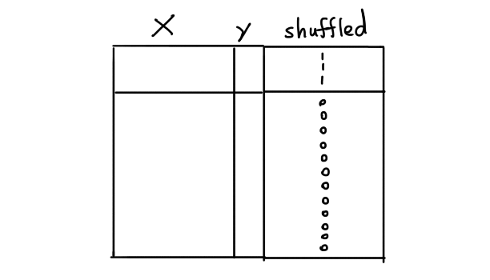
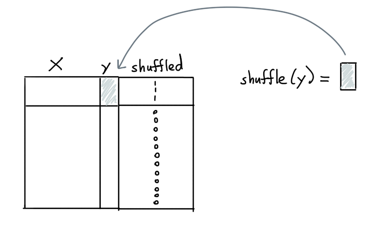

The goal of this document is to explain how we might be able to measure
the effectiveness of finding bad labels.

!!! Info
    This document shows a way to run benchmarks with this library. It deserves
    to be said that this part of the library is the most experimental and may
    change in the future as we receive community feedback.

## How to Measure

There are a lot of reasons that you might doubt a sample of data. We prefer
to limit ourselves to the generally effective methods out there. But how can
we measure effectiveness? In reality we could only do that if we know which
labels are bad and which are good. But if we knew that, we wouldn't need this
library.

### Simulation

That's why, as a proxy, we allow you to run benchmarks using simulations. While
this certainly is not a perfect approach, it is also not wholly unreasonable.

Here's how we add labels. Suppose that we have a dataset `X` with some
labels `y` that we'd like to predict. If we assume that the labels `y`
are correct we can simulate bad labels by designating a few labels
to be shuffled.



For the rows designated to be shuffled, we can now select the `y` values
and change them. For classification problems we can flip the labels such
that another label than the original `y`-label is chosen. For regression
we can instead shuffle all the values.



We can now pass this data to an ensemble and in hindsight see if we're
able to uncover which values were flipped. At the very least, we should
be able to confirm that if we sort based on our "reasons" that we select
bad labels at a rate that's better than random.

## Demonstration

Let's proceed by running a small demonstration.

### Dataset

We'll use a subset of the [clinc dataset](https://github.com/clinc/oos-eval) for this demonstration.
It's a dataset that contains text that might be used in a chatbot-like setting and the goal
is to predict what the original intent behind the text might be.

```python
import numpy as np
import pandas as pd

url = "https://raw.githubusercontent.com/koaning/optimal-on-paper/main/data/outofscope-intent-classification-dataset.csv"
df = pd.read_csv(url).head(5000)
df.sample(3)
```

Here's what the sample of the data might look like:

| text                                | label           |
|:------------------------------------|:----------------|
| what is my visa credit limit        | credit_limit    |
| i want to eat something from turkey | meal_suggestion |
| what is life's meaning              | meaning_of_life |

The goal of this dataset is to classify the text into predefined
categories. We're only looking at the top 5000 rows to keep the
computation of this example lightweight. Let's start by formally
making a `X`, `y` pair.

```python
X = list(df['text'])
y = df['label']
```

### Flipping Labels

We can now use some utilities from the benchmarking submodule to
flip the labels.

```python
from doubtlab.benchmark import flip_labels

y_flip, flip_indicator = flip_labels(y, n=200)
```

You'll now have;

- `y_flip`: which contains the original labels with 200 labels that are flipped.
- `flip_indicator`: which is a numpy array that indicates if a label did (with value 1.0) or did not (with value 0.0) got flipped.

!!! Info

    We're using `flip_labels` here because we're working on a classification
    task. If you were working on a regression task we recommend using `shuffle_labels`
    instead.

    ```python
    from doubtlab.benchmark import shuffle_labels

    y_flip, flip_indicator = shuffle_labels(y, n=200)
    ```

### Ensemble

Given that we now have data to compare against, let's make a `DoubtEnsemble`.

```python
from sklearn.linear_model import LogisticRegression
from sklearn.pipeline import make_pipeline, make_union
from sklearn.feature_extraction.text import CountVectorizer

from doubtlab.ensemble import DoubtEnsemble
from doubtlab.reason import ProbaReason, ShortConfidenceReason, LongConfidenceReason


model = make_pipeline(
    CountVectorizer(),
    LogisticRegression(max_iter=1000, class_weight="balanced")
)
model.fit(X, y_flip)

ensemble = DoubtEnsemble(
    proba = ProbaReason(model),
    short = ShortConfidenceReason(model, threshold=0.2),
    long = LongConfidenceReason(model, threshold=0.9),
)
```

With an ensemble defined, we can now proceed by generating a dataframe with predicates.

```python
# First, get our dataframe with predicates
predicate_df = ensemble.get_predicates(X, y_flip)
```

## Precision and Recall at `k`

Given our sorted dataframe with predicates we can now wonder how well we did in finding bad
labels. A common proxy for this is to consider the recall and precision "at k" metric.

- *Precision at k*: suppose that we look at the top 10 rows of data to check, how many
of these turn out to be bad labels? What if we look at the top 20? That's what precision
at k tells you.
- *Recall at k*: suppose that we look at the top 10 rows of data to check, what percentage
of all the bad labels will we have found? What if we look at the top 20? That's what recall
at k tells you.

The idea here is that precision and recall are a bit at odds with eachother. The higher the
value for `k` the larger your recall is bound to be but the harder it will be to guarantee
a high precision. For lower `k` values you're only looking at the most likely candidates so
you're more sure that you've got bad labels but you're also more sure that you don't have
all of them.

### Plotting

Let's now use the predicate dataframe with our `idx_flip` array from before to
determine if our approach gives us a better than random statistics.

```python
from doubtlab.benchmark import plot_precision_recall_at_k

# Let's plot some `precision/recall at k` statistics!
plot_precision_recall_at_k(predicate_df, flip_indicator, max_k=2000)
```

<script src="https://cdn.jsdelivr.net/npm/vega@5"></script>
<script src="https://cdn.jsdelivr.net/npm/vega-lite@5"></script>
<script src="https://cdn.jsdelivr.net/npm/vega-embed@6"></script>
<script src="https://cdn.jsdelivr.net/gh/koaning/justcharts/justcharts.js"></script>

<vegachart schema-url="../benchmark-1.json"></vegachart>

In this interactive chart (you can pan/zoom) you can see dashed lines for precision/recall
if we were going to be pulling bad label candidates at random. The straight lines represent
the values the precision/recall values that we would achieve with our ensemble. As you can
see we do seem to achieve an uplift over picking items randomly.

That said, we shouldn't pretend that this library guarantees that you'll only get bad examples!
The highest precision we ever measure is around 12%, which means that you may only get
an example that reserves relabelling every 10 items or so.

## What Causes Uplift?

You might ask the question; what can we do to cause the biggest uplift here?

It depends a bit on what you want, but we can cause a shift in behavior by
using a different ensemble. Let's create one that only uses the `ProbaReason`.

```python
ensemble = DoubtEnsemble(
    proba = ProbaReason(model),
    # short = ShortConfidenceReason(model, threshold=0.2),
    # long = LongConfidenceReason(model, threshold=0.9),
)
```

If we re-run everything, here's what the new chart looks like.

<vegachart schema-url="../benchmark-2.json"></vegachart>

The recall performance is much worse, but notice how the first few examples
have a very high precision! That said, we should remember that we're basing
everything on a simulation here, so feel free to take everything with a grain of salt.

## Understanding

The effectiveness of a `DoubtEnsemble` is something we'd like to study
further. After all, there's a lot of variables to consider!

- A classification task with few classes might need to be treated differently than one with many classes.
- It's possible that text classification tasks might benefit from having multiple models, some of which are based on embeddings.
- Given another process of flipping labels we may also benefit from other components.
- We may want to consider different ways of sorting/weighting the different reasons in our ensemble. Maybe our reasons should emit a confidence value instead of just a 0/1 indicator. That way we may be able to use a confidence-like proxy.
- The current simulation may not reflect real life. Maybe there are better ways of simulating bad labels that we can consider for our benchmarks here.

It's still a bit of an open problem. If you ever manage to run an
interesting benchmark with some learnings, please let us know via an issue
on [GitHub](https://github.com/koaning/doubtlab/issues/new).
